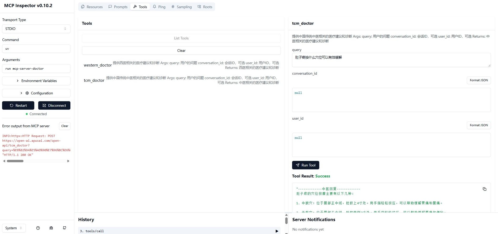

# MCP Server Product Name: Qihuang & Zhicao MCP Medical Assistant MCP Service

apus-medical-mcp-server

## Version Information

v1.0.0

## Product Description

### Short Description

The Qihuang & Zhicao MCP Medical Assistant is a medical consultation service based on the MCP protocol. It provides intelligent medical consultation services integrating Western and Traditional Chinese Medicine (TCM), helping users obtain professional medical advice and diagnoses.

### Long Description

The Qihuang & Zhicao MCP Medical Assistant is an MCP protocol-based medical consultation server that integrates two professional medical consultation systems: Western Medicine and Traditional Chinese Medicine (TCM). Through MCP, it provides intelligent medical consultation services, offering professional medical advice and diagnoses based on users' specific symptoms and questions. It is powered by the Qihuang (Medical) and Zhicao (TCM) large models trained by APUS.

## Category

Medical Consultation

## Tags

Medical, Traditional Chinese Medicine, Western Medicine, Intelligent Diagnosis

## Tools

### Tool 1: Western Medicine Consultation (Qihuang)

#### Detailed Description

Provides medical advice and diagnoses related to Western medicine, including symptom analysis, treatment plans, medication recommendations, and more.

#### Parameters Required for Debugging

Input:
* query: User's question (Required)
* conversation_id: Conversation ID (Optional)
* user_id: User ID (Optional)

Output:
* Medical advice and diagnoses related to Western medicine

### Tool 2: Traditional Chinese Medicine Consultation (Zhicao)

#### Detailed Description

Provides medical advice and diagnoses related to Traditional Chinese Medicine, including TCM syndrome differentiation, herbal prescriptions, health preservation recommendations, and more.

#### Parameters Required for Debugging

Input:
* query: User's question (Required)
* conversation_id: Conversation ID (Optional)
* user_id: User ID (Optional)

Output:
* Medical advice and diagnoses related to Traditional Chinese Medicine

## Compatible Platforms

Python, FastAPI, MCP


## Authentication Method

API Key


## Usage

### Method 1: Download Code Locally

```bash
git clone https://git.apuscn.com:8443/ai-team/apus-mcp-server

cd mcp-server-doctor

uv pip install -e .

npx -y @modelcontextprotocol/inspector uv run mcp-server-doctor
```

Access the page to start using the Qihuang and Zhicao MCP services.




### Method 2: Configure in Client
```
  "mcpServers": {
    "mcp-server-doctor": {
      "command": "uv",
      "args": [
        "--directory",
        "/path/to/mcp-server-doctor",
        "run",
        "mcp-server-doctor"
      ],
      "env": {
        "DOCTOR_API_KEY": "sk-****"
      }
    }
  }
```

## Obtaining an API Key

To obtain an API Key, please contact: bd [at] apusai.com
