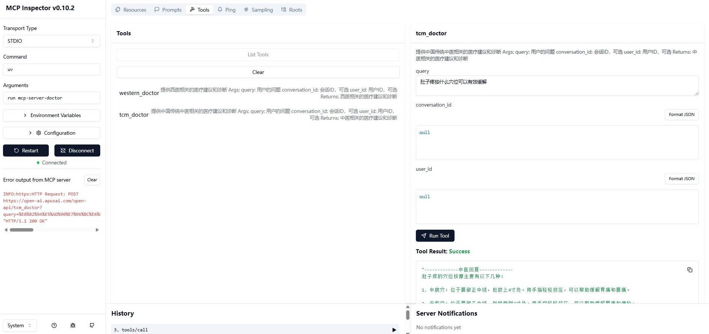

# MCP Server 产品名称: 奇黄&智草MCP医疗助手的MCP服务

apus-medical-mcp-server

## 版本信息

v1.0.0

## 产品描述

### 短描述

奇黄&智草MCP医疗助手是一个基于MCP协议的医疗咨询服务，提供中西医结合的智能医疗咨询服务，帮助用户获取专业的医疗建议和诊断。

### 长描述

奇黄&智草MCP医疗助手是一个基于MCP协议的医疗咨询服务器，集成了西医和中医两个专业的医疗咨询系统。通过MCP提供智能化的医疗咨询服务，能够根据用户的具体症状和问题，提供专业的医疗建议和诊断。其背后是APUS公司训练的岐黄（医疗）和智草（中医）大模型。

## 分类

医疗咨询

## 标签

医疗, 中医, 西医, 智能诊断

## Tools

### Tool1: 西医咨询（奇黄）

#### 详细描述

提供西医相关的医疗建议和诊断，包括症状分析、治疗方案、用药建议等。

#### 调试所需要的参数

输入:
* query: 用户的问题(必填)
* conversation_id: 会话ID (可选)
* user_id: 用户ID (可选)

输出:
* 西医相关的医疗建议和诊断

### Tool2: 中医咨询（智草）

#### 详细描述

提供中国传统中医相关的医疗建议和诊断，包括中医辨证、中药处方、养生建议等。

#### 调试所需要的参数

输入:
* query: 用户的问题(必填)
* conversation_id: 会话ID (可选)
* user_id: 用户ID (可选)

输出:
* 中医相关的医疗建议和诊断

## 可适配平台

Python, FastAPI, MCP


## 鉴权方式

API Key


## 使用

### 方式一：下载代码至本地

```bash
git clone https://git.apuscn.com:8443/ai-team/apus-mcp-server

cd mcp-server-doctor

uv pip install -e .

npx -y @modelcontextprotocol/inspector uv run mcp-server-doctor
```

访问页面，开始使用奇黄、智草MCP服务




### 方式二：在客户端中配置
```
  "mcpServers": {
    "mcp-server-doctor": {
      "command": "uv",
      "args": [
        "--directory",
        "/path/to/mcp-server-doctor",
        "run",
        "mcp-server-doctor"
      ],
      "env": {
        "DOCTOR_API_KEY": "sk-****"
      }
    }
  }
```

## API Key 获取

需要 API Key 请联系：bd [at] apusai.com
